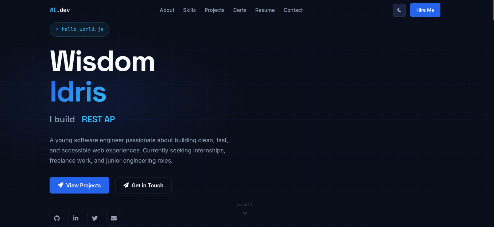

# Wisdom Idris — Software Engineer Portfolio

## Overview


[](https://idrissa.dev)
[](https://idrissa.dev)
[](https://idrissa.dev)
[](LICENSE)

> A world-class portfolio built to win internships, freelance clients, and junior engineering roles.
> Live at: **[wisdom.dev](https://wisdom.dev)**

---

## ✦ What's inside

| Section | Description |
|---|---|
| **Hero** | Terminal-style typewriter cycling through roles |
| **About** | Personal story, availability badge, quick facts |
| **Skills** | Animated progress bars across Frontend / Backend / Tools |
| **Projects** | 6 recruiter-loved projects with filter by category |
| **Certifications** | Verified credentials with links |
| **Resume** | Timeline layout + one-click PDF download |
| **Contact** | Validated form with clear response-time commitment |

---

## 🚀 Deployment (Free — 3 options)

### Option 1: GitHub Pages (Recommended — free, instant)
```bash
# 1. Create a repo named: wisdom-idris.github.io
# 2. Push index.html to the main branch
git init
git add .
git commit -m "feat: launch portfolio"
git remote add origin https://github.com/wisdom-idris/github.io.git
git push -u origin main
# Live at: https://wisdom-idris.github.io
```

### Option 2: Netlify Drop (Fastest — no CLI needed)
```
1. Go to https://app.netlify.com/drop
2. Drag the entire wisdom-portfolio/ folder onto the page
3. Live in seconds with a *.netlify.app URL
4. Connect a custom domain for free
```

### Option 3: Vercel (Best for future React version)
```bash
npm i -g vercel
cd wisdom-portfolio
vercel --prod
# Follow prompts — live in 30 seconds
```

---

## 🎨 Design Decisions (for interviewers)

### "Blueprint Midnight" palette
- `#0A0E1A` — Deep navy (not pure black — warmer, more human)
- `#2563EB` — Electric blue primary (confidence, clarity)
- `#38BDF8` — Sky accent (energy, youth)

**Why not the typical dark-green on black?** That palette is the default for every dev portfolio template. This palette is deliberate and distinctive while still being professional.

### Typography
- **Space Grotesk** — display headings: geometric, technical personality
- **Inter** — body: maximum readability at all sizes
- **JetBrains Mono** — labels/code: authentic developer signal

### Signature Element: Terminal Typewriter
The blinking cursor + typewriter in the hero is not decorative — it's the first thing that tells a recruiter "this person thinks like a developer." It cycles through real skills, not fluff.

---

## 🏗️ Architecture

```
wisdom-portfolio/
│
├── index.html          # Complete portfolio (single-file, zero build step)
├── README.md           # This file
│
└── [Future React version]
    ├── src/
    │   ├── components/
    │   │   ├── Navbar.tsx
    │   │   ├── Hero.tsx
    │   │   ├── About.tsx
    │   │   ├── Skills.tsx
    │   │   ├── Projects.tsx
    │   │   ├── Certifications.tsx
    │   │   ├── Resume.tsx
    │   │   ├── Contact.tsx
    │   │   └── Footer.tsx
    │   ├── hooks/
    │   │   ├── useTypewriter.ts
    │   │   ├── useScrollReveal.ts
    │   │   └── useTheme.ts
    │   ├── data/
    │   │   ├── projects.ts
    │   │   ├── skills.ts
    │   │   └── certifications.ts
    │   └── App.tsx
    ├── public/
    ├── vite.config.ts
    └── package.json
```

---

## ✏️ Personalizing (Step-by-Step)

### 1. Update your real information
Search and replace these placeholders in `index.html`:

| Placeholder | Replace with |
|---|---|
| `wisdom@email.com` | Your real email |
| `wisdom-idris` (GitHub) | Your GitHub username |
| `wisdom-wisdom` (LinkedIn) | Your LinkedIn slug |
| `wisdom.dev` | Your domain |

### 2. Add your real projects
Each project card lives in the `#projects` section. Copy the template:
```html
<article class="card project-card reveal" data-category="fullstack"
         aria-label="ProjectName — Description">
  <div class="project-header">
    <div class="project-icon">🔧</div>
    <div class="project-links">
      <a href="https://github.com/YOUR_USERNAME/REPO" ...>GitHub</a>
      <a href="https://your-live-demo.vercel.app" ...>Live</a>
    </div>
  </div>
  <h3 class="project-title">Project Name</h3>
  <p class="project-description">What it does and why it matters.</p>
  <div class="project-impact">✦ Key metric · Key metric · Key metric</div>
  <div class="tech-tags">
    <span class="tech-tag">React</span>
    <!-- Add your stack -->
  </div>
</article>
```

### 3. Connect the contact form
The form is currently simulated. For real messages, pick one:

**Formspree (easiest):**
```html
<form action="https://formspree.io/f/YOUR_FORM_ID" method="POST">
```

**EmailJS (no backend):**
```javascript
emailjs.sendForm('YOUR_SERVICE_ID', 'YOUR_TEMPLATE_ID', form);
```

### 4. Add your photo
Replace the initials avatar with a real photo:
```html
<!-- Find .about-avatar and replace its contents with: -->

```

### 5. Update skill percentages
In the skills section, adjust `data-width` values (0-100):
```html
<div class="skill-bar-fill" data-width="82"></div>
<!-- Be honest! Recruiters WILL ask about these -->
```

---

## 📋 Recruiter-Loved Projects (What to build next)

These are the project types that get the most traction with technical recruiters:

| Project | Why Recruiters Love It | Tech Stack |
|---|---|---|
| **Full-stack CRUD app with auth** | Shows end-to-end thinking | React + Node + MongoDB |
| **Real-time chat app** | Shows WebSockets/async knowledge | Socket.io + React |
| **REST API with documentation** | Shows backend + professionalism | Node + Swagger |
| **Clone of a real product** | Shows you can read and replicate UX | Any |
| **Something that solves YOUR problem** | Shows initiative and story | Your choice |
| **Open source contribution** | Shows you can read others' code | Any |

---

## ♿ Accessibility Checklist

- [x] Skip navigation link
- [x] All images have `alt` text
- [x] All interactive elements have `aria-label`
- [x] Color contrast ratio meets WCAG AA
- [x] Keyboard-navigable (Tab, Escape)
- [x] `aria-live` regions for dynamic content
- [x] `prefers-reduced-motion` respected
- [x] Semantic HTML5 elements (`<nav>`, `<main>`, `<section>`, `<article>`, `<footer>`)
- [x] Form inputs have associated `<label>` elements
- [x] Focus styles visible

---

## 🔍 SEO Checklist

- [x] Descriptive `<title>` tag
- [x] `<meta name="description">` under 160 characters
- [x] Open Graph tags (LinkedIn/Twitter previews)
- [x] Canonical URL
- [x] Semantic heading hierarchy (one `<h1>`, logical `<h2>` order)
- [x] Image alt text
- [x] Clean, human-readable URL structure
- [ ] Sitemap.xml (add when deploying to custom domain)
- [ ] Google Search Console verification (add after deployment)

---

## ⚡ Performance Checklist

- [x] Single-file (no HTTP round-trips for JS/CSS)
- [x] `preconnect` hints for Google Fonts
- [x] `IntersectionObserver` instead of scroll event listeners
- [x] `passive: true` on scroll listeners
- [x] CSS animations use `transform` (GPU-accelerated, not layout-triggering)
- [x] Font `display=swap` for no render blocking
- [ ] Compress and WebP-convert photos when you add them
- [ ] Add `loading="lazy"` to images below the fold

---

## 🗺️ Roadmap — What to Build Next

### Milestone 1 (NOW — Week 1)
- [ ] Deploy to GitHub Pages
- [ ] Update all placeholder info with real data
- [ ] Add real GitHub links to all projects

### Milestone 2 (Week 2-3)
- [ ] Connect contact form with Formspree
- [ ] Add your real photo
- [ ] Upload and link resume PDF

### Milestone 3 (Month 2)
- [ ] Rebuild in React + Vite + TypeScript
- [ ] Add project case studies (longer write-ups)
- [ ] Add a blog section (recruiters love this)

### Milestone 4 (Month 3)
- [ ] Custom domain (idrissa.dev ~$10/year)
- [ ] Add Google Analytics
- [ ] Add Lighthouse CI to GitHub Actions

---

## 📄 License

MIT — use this as a template and make it yours.

---

*Built by Wisdom Idris · 2026*
